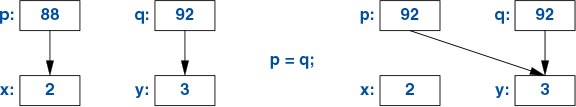
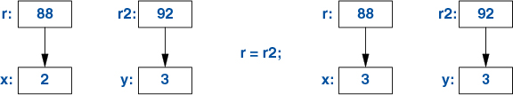

# Chapter 1: The Basics

## Constants
- const: meaning roughly “I promise not to change this value.” This is used primarily to specify interfaces so that data can be passed to functions using pointers and references without fear of it being modified. The compiler enforces the promise made by const. The value of a const may be calculated at run time.

- constexpr: meaning roughly “to be evaluated at compile time.” This is used primarily to specify constants, to allow placement of data in read-only memory (where it is unlikely to be corrupted), and for performance. The value of a constexpr must be calculated by the compiler.

- When we want a function to be used only for evaluation at compile time, we declare it consteval rather than constexpr. For example:

```cpp
consteval double square2(double x) { return x*x; }

constexpr double max1 = 1.4*square2(17);            // OK: 1.4*square(17) is a constant expression
const double max3 = 1.4*square2(var);                  // error: var is not a constant
```

## Assignment
```cpp
int x = 2;
int y = 3;
x = y;               // x becomes 3; so we get x==y
```


If we want different objects to refer to the same (shared) value, we must say so. For example:
```cpp
int x = 2;
int y = 3;
int* p = &x;
int* q = &y;       // p!=q and *p!=*q
p = q;                // p becomes &y; now p==q, so (obviously)*p==*q
```


I arbitrarily chose 88 and 92 as the addresses of the ints. Again, we can see that the assigned-to object gets the value from the assigned object, yielding two independent objects (here, pointers), with the same value. That is, p=q gives p==q. After p=q, both pointers point to y.

A **reference** and a **pointer** both refer/point to an object and both are represented in memory as a machine address. However, the language rules for using them differ. Assignment to a reference does not change what the reference refers to but assigns to the referenced object:

```cpp
int x = 2;
int y = 3;
int& r = x;        // r refers to x
int& r2 = y;      // r2 refers to y
r = r2;              // read through r2, write through r: x becomes 3
```


To access the value pointed to by a pointer, you use *; that is implicitly done for a reference.

After x=y, we have x==y for every built-in type and well-designed user-defined type (Chapter 2) that offers = (assignment) and == (equality comparison).

## Initialization
Initialization differs from assignment. In general, for an assignment to work correctly, the assigned-to object must have a value. On the other hand, the task of initialization is to make an uninitialized piece of memory into a valid object. For almost all types, the effect of reading from or writing to an uninitialized variable is undefined.

```cpp
int x = 7;
int& r {x};         // bind r to x (r refers to x)
r = 7;                // assign to whatever r refers to

int& r2;            // error: uninitialized reference
r2 = 99;            // assign to whatever r2 refers to
```

```cpp
int& r = x;        // bind r to x (r refers to x)
```
This is still initialization and binds r to x, rather than any form of value copy.
